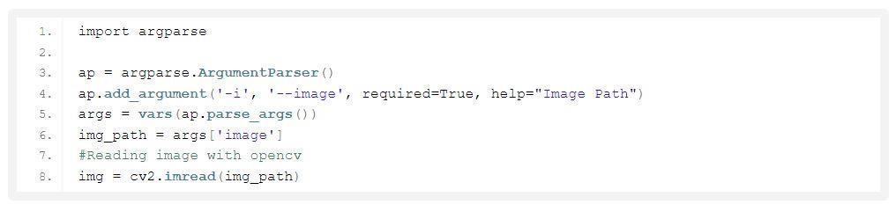
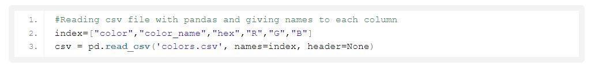
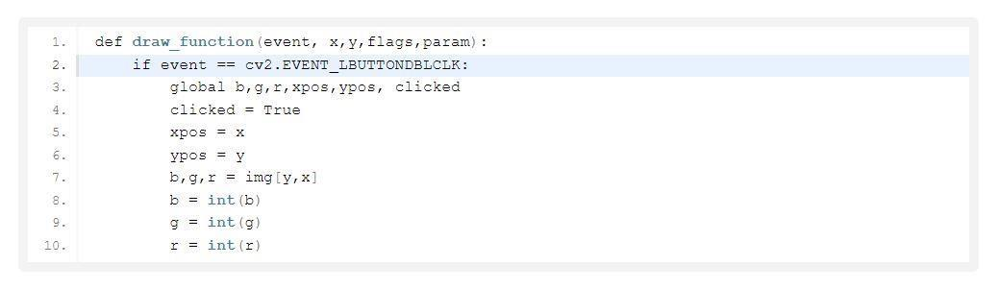
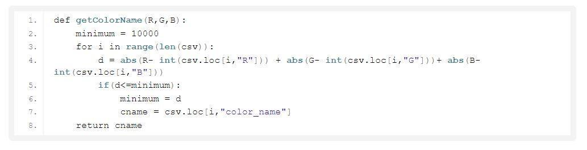
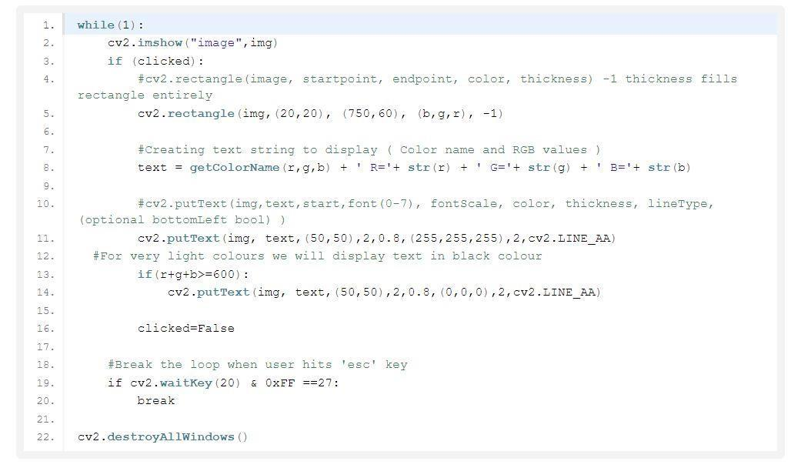
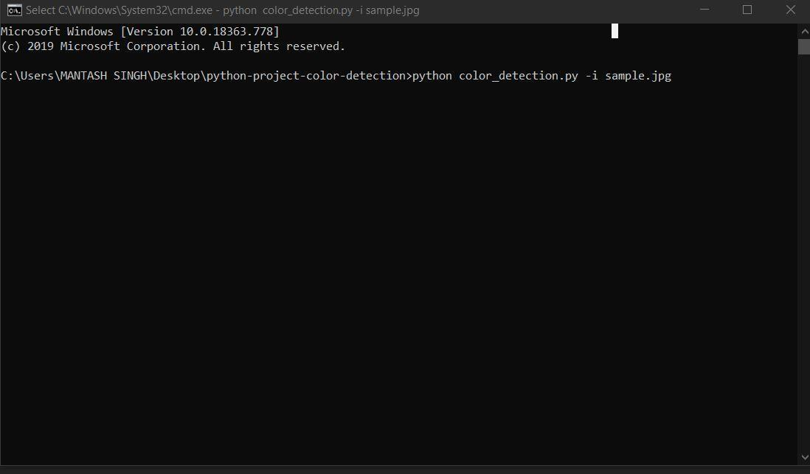
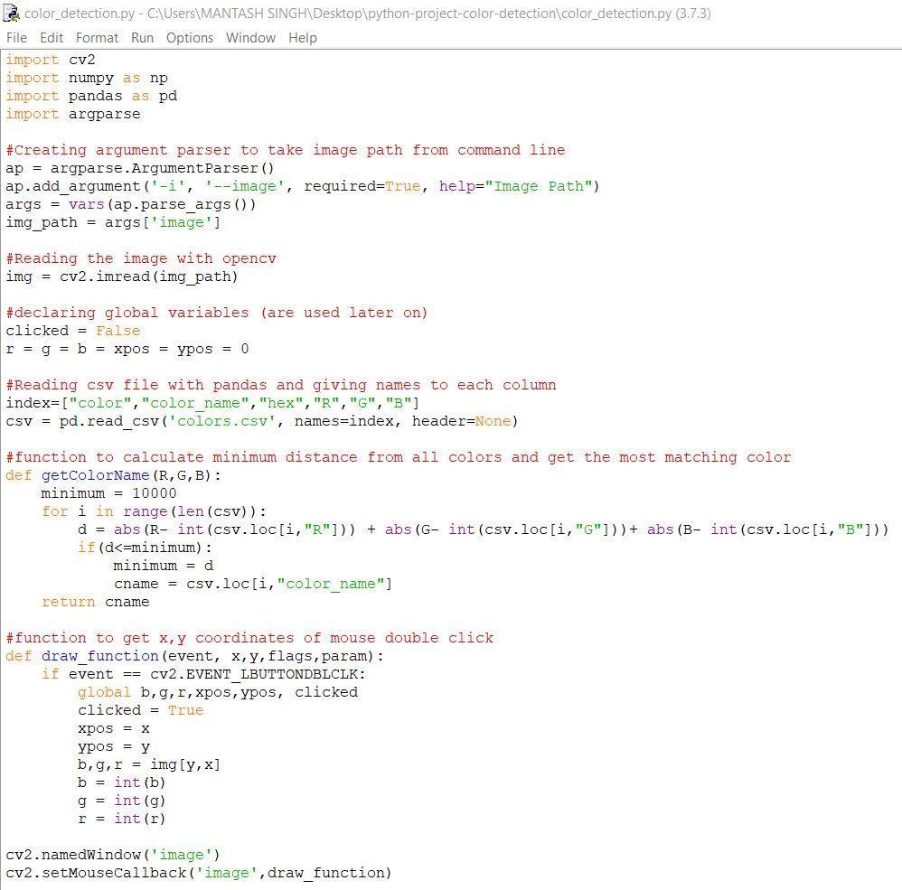
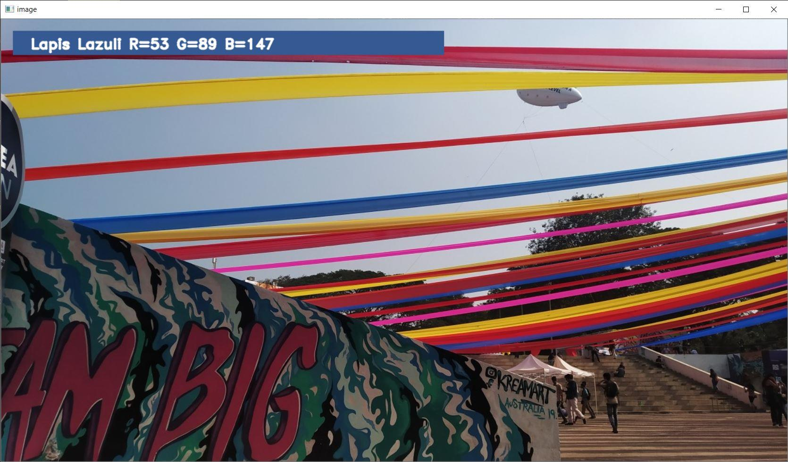

## PACKAGES WE USED

### 1 OpenCV

OpenCV-Python is an appropriate tool for fast prototyping of computer vision problems.

OpenCV introduces a new set of tutorials which will guide you through various functions available in OpenCV-Python. This guide is mainly focused on OpenCV 3.x version (although most of the tutorials will work with OpenCV 2.x also).

A prior knowledge on Python and Numpy is required before starting because they won&#39;t be covered in this guide. Especially, a good knowledge on Numpy is must to write optimized codes in OpenCVPython.

### 2 NumPy

NumPy is the fundamental package for scientific computing with Python. It contains among other things:

- a powerful N-dimensional array object
- sophisticated (broadcasting) functions
- tools for integrating C/C++ and Fortran code
- useful linear algebra, Fourier transform, and random number capabilities

Besides its obvious scientific uses, NumPy can also be used as an efficient multi-dimensional container of generic data. Arbitrary datatypes can be defined. This allows NumPy to seamlessly and speedily integrate with a wide variety of databases.

NumPy is licensed under the[BSD license,](https://numpy.org/license.html#license) enabling reuse with few restrictions.

### 3 PANDAS

**pandas** is a[software library](https://en.wikipedia.org/wiki/Software_library)written for the[Python programming language](https://en.wikipedia.org/wiki/Python_(programming_language))for data manipulation and analysis. In particular, it offers data structures and operations for manipulating numerical tables and[time series.](https://en.wikipedia.org/wiki/Time_series) It is[free software](https://en.wikipedia.org/wiki/Free_software)released under the[three-clause BSD license](https://en.wikipedia.org/wiki/3-clause_BSD_license)[.](https://en.wikipedia.org/wiki/Pandas_(software)#cite_note-2)[[2]](https://en.wikipedia.org/wiki/Pandas_(software)#cite_note-2)The name is derived from the term &quot;[panel data&quot;](https://en.wikipedia.org/wiki/Panel_data), an[econometrics](https://en.wikipedia.org/wiki/Econometrics)term for data sets that include observations over multiple time periods for the same individuals.

Library features

- DataFrame object for data manipulation with integrated indexing.
- Tools for reading and writing data between in-memory data structures and different file formats.
- Data alignment and integrated handling of missing data.
- Reshaping and pivoting of data sets.
- Label-based slicing, fancy indexing, and subsetting of large data sets.
- Data structure column insertion and deletion.
- Group by engine allowing split-apply-combine operations on data sets.
- Data set merging and joining.
- Hierarchical axis indexing to work with high-dimensional data in a lower-dimensional data structure.
- Time series-functionality: Date range generation[[4]](https://en.wikipedia.org/wiki/Pandas_(software)#cite_note-4)and frequency conversion, moving window statistics, moving window linear regressions, date shifting and lagging.
- Provides data filtration.

##

##
# ABOUT THE PROJECT

#

## OUR PROJECT – COLOR DETECTION

In this color detection Python project, we are going to build an application through which you can automatically get the name of the color by clicking on them. So for this, we will have a data file that contains the color name and its values. Then we will calculate the distance from each color and find the shortest one.

## What is Colour Detection?

Colour detection is the process of detecting the name of any color. Simple isn&#39;t it? Well, for humans this is an extremely easy task but for computers, it is not straightforward. Human eyes and brains work together to translate light into color. Light receptors that are present in our eyes transmit the signal to the brain. Our brain then recognizes the color. Since childhood, we have mapped certain lights with their color names. We will be using the somewhat same strategy to detect color names.

## The Dataset

Colors are made up of 3 primary colors; red, green, and blue. In computers, we define each color value within a range of 0 to 255. So in how many ways we can define a color? The answer is **256\*256\*256 = 16,581,375**. There are approximately 16.5 million different ways to represent a color. In our dataset, we need to map each color&#39;s values with their corresponding names. But don&#39;t worry, we don&#39;t need to map all the values. We will be using a dataset that contains RGB values with their corresponding names. The CSV file for our dataset has been taken from this link:

[https://github.com/codebrainz/color-names/blob/master/output/colors.csv](https://github.com/codebrainz/color-names/blob/master/output/colors.csv)

The colors.csv file includes 865 color names along with their RGB and hex values.

### Colors Dataset

The colors.csv file is a data set we used here , it includes **865** color names along with their RGB and hex values.

## Prerequisites

Before starting with this Python project with source code, we should be familiar with the computer vision library of Python that is[_ **OpenCV** _](https://data-flair.training/blogs/opencv-python-tutorial/)and[_ **Pandas** _](https://data-flair.training/blogs/pandas-tutorials-home/)[**.**](https://data-flair.training/blogs/pandas-tutorials-home/)

**OpenCV, Pandas, and numpy** are the Python packages that are necessary for this project in Python. To install them, simply run this pip command in your terminal:

!

# **STEPS FOR BULIDING COLOR**

#

# **DETECTION PROJECT**

#

## 1 Taking an image from the user

We are using argparse library to create an argument parser. We can directly give an image path from the command prompt:

2 We read the CSV file with pandas

The pandas library is very useful when we need to perform various operations on data files like CSV. **pd.read\_csv()** reads the CSV file and loads it into the pandas DataFrame. We have assigned each column with a name for easy accessing.

!

## 3 Set a mouse call back event on a window

First, we created a window in which the input image will display. Then, we set a callback function which will be called when a mouse event happens.

With these lines, we named our window as &#39;image&#39; and set a callback function which will call the **draw\_function()** whenever a mouse event occurs.

## 4 Create the draw\_function

It will calculate the rgb values of the pixel which we double click. The function parameters have the event name, (x,y) coordinates of the mouse position, etc. In the function, we check if the event is doubleclicked then we calculate and set the r,g,b values along with x,y positions of the mouse.

## 5 Calculate distance to get color name

We have the r,g and b values. Now, we need another function which will return us the color name from RGB values. To get the color name, we calculate a distance(d) which tells us how close we are to color and choose the one having minimum distance. Our distance is calculated by this formula:

_d = abs(Red – ithRedColor) + (Green – ithGreenColor) + (Blue – ithBlueColor)_

## 6 Display image on the window

Whenever a double click event occurs, it will update the color name and RGB values on the window.

Using the **cv2.imshow()** function, we draw the image on the window. When the user double clicks the window, we draw a rectangle and get the color name to draw text on the window using **cv2.rectangle** and **cv2.putText()** functions.

#

# OUTPUT

## 1 Run Python File

We can run the Python file from the command prompt. Make sure to give an image path using &#39;-i&#39; argument. If the image is in another directory, then you need to give full path of the image:

## 2Screenshot of the program

## 3 Output

